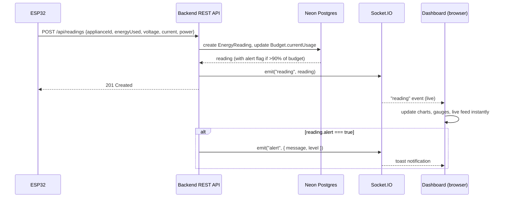
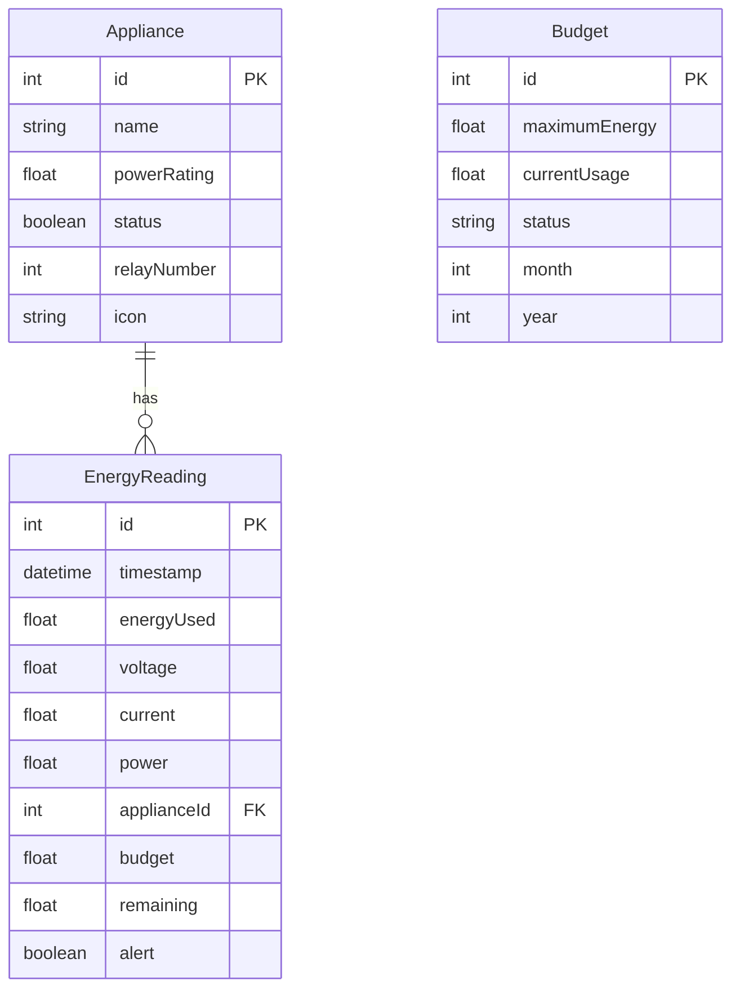
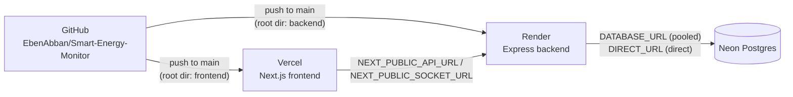

# Smart Energy Monitor

A full-stack IoT energy monitoring platform. An ESP32 microcontroller measures a home appliance's live voltage, current, and power draw, streams readings to a backend over Wi-Fi, and a web dashboard visualizes usage in real time — with budgets, alerts, history, and cost/CO₂ estimates.

**Live:**
- Frontend: [smart-energy-monitor-roan.vercel.app](https://smart-energy-monitor-roan.vercel.app) (Vercel)
- Backend: `smart-energy-monitor-x91l.onrender.com` (Render)
- Database: Neon (managed Postgres)

---

## Table of Contents

- [What it does](#what-it-does)
- [Architecture](#architecture)
- [Repository layout](#repository-layout)
- [Backend](#backend)
- [Frontend](#frontend)
- [Firmware](#firmware)
- [Data model](#data-model)
- [Real-time events](#real-time-events)
- [Deployment topology](#deployment-topology)
- [Environment variables](#environment-variables)
- [Local development](#local-development)
- [Known limitations](#known-limitations)

---

## What it does

1. An **ESP32** reads a current transformer (SCT-013) and voltage sensor (ZMPT101B), computes energy/power draw for the appliance it's wired to, and posts a reading to the backend every 2 seconds. It can also switch a relay on/off to physically turn that appliance on or off, driven remotely from the dashboard.
2. The **backend** (Express + Prisma + Postgres) stores every reading, tracks a monthly energy budget, computes derived stats (totals, hourly breakdowns, per-appliance breakdowns, cost/CO₂ estimates), and pushes live updates to connected browsers over Socket.IO.
3. The **frontend** (Next.js dashboard) shows live power draw, historical charts, a budget gauge, appliance on/off controls, exportable history/reports, and toast alerts when usage crosses a budget threshold — all updating in real time without a page refresh.

There's no authentication layer — this is a single-household / single-tenant monitoring tool, not a multi-user SaaS product.

## Architecture

```mermaid
flowchart LR
    subgraph Device["ESP32 Firmware"]
        CT["SCT-013 current sensor"] --> MCU
        VS["ZMPT101B voltage sensor"] --> MCU
        MCU["ESP32"] -->|drives| Relay["Relay (appliance power)"]
    end

    MCU -->|"POST /api/readings\n(Wi-Fi, every 2s)"| Backend
    MCU -->|"GET /api/appliances/:id\n(poll relay command)"| Backend

    subgraph Backend["Backend — Express + Socket.IO (Render)"]
        API["REST API"]
        IO["Socket.IO server"]
        Prisma["Prisma Client\n(cold-start retry wrapper)"]
        API --> Prisma
        API -->|emit on write| IO
    end

    Prisma <-->|"pooled + direct\nconnections"| DB[("Neon Postgres")]

    IO <-->|WebSocket| Browser
    Backend <-->|REST (fetch)| Browser

    subgraph Frontend["Frontend — Next.js (Vercel)"]
        Browser["Dashboard UI\n(App Router, client components)"]
    end
```

**Request/event flow for a single reading:**



## Repository layout

```
.
├── backend/          Express + Prisma REST API and Socket.IO server
├── frontend/          Next.js 16 (App Router) dashboard
├── firmware/
│   └── sems-esp32/    Arduino sketch for the ESP32
└── package.json        Root scripts that orchestrate backend + frontend together
```

The root `package.json` is a thin orchestration layer (no shared dependencies/workspaces) — `npm run dev` runs both dev servers concurrently, `npm run build` builds both.

## Backend

`backend/` — Node.js + TypeScript, Express 4, Socket.IO 4, Prisma 5, PostgreSQL.

```
backend/src/
├── index.ts               Express app setup, Socket.IO server, route mounting
├── lib/prisma.ts           Shared Prisma client + Neon cold-start retry wrapper
├── routes/                 Thin HTTP handlers (validation + status codes)
│   ├── readings.ts         POST/GET /api/readings
│   ├── appliances.ts       GET/POST /api/appliances, PUT /:id/status
│   ├── budget.ts           GET/PUT /api/budget
│   └── dashboard.ts        GET /api/dashboard
├── services/                Business logic, called by routes
│   ├── energyService.ts     Dashboard aggregation, reading ingestion, budget math
│   ├── applianceService.ts  Appliance CRUD
│   └── budgetService.ts     Monthly budget get/upsert
└── types/index.ts           Shared request/response + Socket.IO event types
```

### REST API

| Method | Path | Purpose |
|---|---|---|
| `GET` | `/api/health` | Liveness + DB connectivity check |
| `GET` | `/api/dashboard` | Aggregated stats for today: total energy, current power, hourly usage, appliance breakdown, budget status |
| `GET` | `/api/readings` | Paginated reading history, filterable by `applianceId`, `from`, `to`, `limit`, `offset` |
| `POST` | `/api/readings` | Ingest a reading from the ESP32 (also updates the running budget total and emits `reading`/`alert` events) |
| `GET` | `/api/appliances` | List all appliances |
| `GET` | `/api/appliances/:id` | Get one appliance (also what the ESP32 polls to check its commanded relay state) |
| `POST` | `/api/appliances` | Register a new appliance (name, power rating, relay number, icon) |
| `PUT` | `/api/appliances/:id/status` | Turn an appliance on/off (emits `applianceStatus`) |
| `GET` | `/api/budget` | Current month's budget |
| `PUT` | `/api/budget` | Set the monthly budget maximum (emits `budgetUpdate`) |

### Dashboard aggregation (`energyService.getDashboardData`)

Pulls every `EnergyReading` since midnight, joined with its `Appliance`, plus all appliances and the current month's `Budget`, then derives in-memory:
- `totalEnergy` — sum of `energyUsed` today
- `currentPower` — sum of each appliance's most recent `power` reading (a live snapshot, not a sum of history)
- `activeAppliances` / `totalAppliances`
- `hourlyUsage` — energy summed per hour-of-day, for the usage chart
- `applianceBreakdown` — energy and % share per appliance, for the pie chart
- `budgetUsage` / `budgetMaximum` / `alerts` — from the `Budget` row and reading `alert` flags

### Neon cold-start retry

Neon's free tier suspends its compute after idle time; the first query after a suspend fails with a connection error while it wakes back up (typically well under a second). `lib/prisma.ts` wraps the Prisma client in a `$extends` query extension that catches that specific "Can't reach database server" error and retries with backoff (up to 3 attempts, 400ms/800ms/1200ms) before letting a real failure through — so routes don't need to know about this, and normal outages still surface as real 500s.

## Frontend

`frontend/` — Next.js 16 (App Router, Turbopack), React 19, TypeScript, Tailwind CSS v4, Framer Motion, Recharts, Socket.IO client.

```
frontend/src/
├── app/                    One route per folder (App Router)
│   ├── page.tsx             Dashboard — KPI cards, hourly chart, budget gauge, cost breakdown
│   ├── live/                 Live Monitoring — real-time feed of incoming readings
│   ├── appliances/            Appliance list with on/off toggles (confirm dialog before switching)
│   ├── analytics/             Bar/pie charts over dashboard aggregate data
│   ├── history/                Paginated reading history, filter by appliance, CSV export
│   ├── reports/                 Report templates (UI scaffold)
│   ├── settings/                 Budget editor, notification toggles, ESP32 connection status
│   ├── not-found.tsx             404 page (FuzzyText canvas effect)
│   └── layout.tsx                 Root layout: theme provider, global background, sidebar, toast provider
├── components/
│   ├── sidebar.tsx                 Nav, connection status, theme toggle button, Hyperspeed background
│   ├── theme-toggle.tsx             Fixed top-right light/dark switch (every page)
│   ├── theme-provider.tsx            Light/dark/system theme context, persisted to localStorage
│   ├── socket-alert-listener.tsx      Global listener that turns `alert`/`budgetUpdate`/`applianceStatus` socket events into toasts
│   ├── ui/                             Small design-system primitives (card, badge, button, toast, skeleton, gauge, select, switch, dialog, empty-state)
│   └── react-bits/                      Decorative WebGL/canvas effects (see below)
├── services/
│   ├── api.ts                           Typed fetch wrapper over the REST API (`NEXT_PUBLIC_API_URL`)
│   └── socket.ts                        Singleton Socket.IO client (`NEXT_PUBLIC_SOCKET_URL`)
├── hooks/useSocket.ts                     React hook: connects on mount, subscribes to one event, cleans up on unmount
├── lib/
│   ├── utils.ts                           `cn()` class merger, energy/power/currency formatters
│   └── export.ts                          CSV export, cost estimation helper
└── types/index.ts                          Shared API response types (mirrors backend's shapes)
```

### Data flow on a page

Every page follows the same pattern: fetch once via `api.ts` in a `useEffect` for the initial paint, then use `useSocket()` to patch state live as `reading` (and related) events arrive — no polling. `socket-alert-listener.tsx` runs once at the root and turns server-pushed alerts into toast notifications regardless of which page is open.

### Visual effects (`components/react-bits/`)

Ported from [React Bits](https://reactbits.dev) into TypeScript for this codebase:

| Component | Used where | What it is |
|---|---|---|
| `GridScan` | Root layout, full-page background | three.js animated scanning grid |
| `Hyperspeed` | Sidebar background | three.js "light-speed tunnel" effect, recolored emerald |
| `FuzzyText` | 404 page | Canvas-based glitchy text render |
| `Antigravity`, `LaserFlow`, `GradualBlur` | Available, not currently wired into a page (see `/react-bits-preview`) | Particle ring, laser/fog shader, progressive blur overlay |

These are decorative only — they don't touch app data. Note two independent WebGL contexts run simultaneously (GridScan + Hyperspeed) when the sidebar is visible, which is a meaningfully heavier GPU load than a typical dashboard.

## Firmware

`firmware/sems-esp32/sems-esp32.ino` — Arduino sketch for an ESP32 Dev Module.

**Hardware:**
- Current Transformer (SCT-013) → GPIO34 (ADC)
- Voltage Sensor (ZMPT101B) → GPIO35 (ADC)
- Up to 6 relays (one per controllable appliance) → GPIO32, 33, 25, 26, 27, 14 (active-low)

**Behavior:**
1. On boot, connects to Wi-Fi using hardcoded credentials; if unset/unreachable, falls back to an **AP configuration portal** (`SmartEnergyMonitor-Config`) serving a small HTML form to enter Wi-Fi + server details.
2. Every 2 seconds: samples the current sensor 200× and voltage sensor 100×, computes RMS-ish current/voltage/power/energy, and `POST`s a reading to `${serverUrl}/readings`.
3. Also polls `GET ${serverUrl}/appliances/{applianceId}` each loop and toggles its relay to match the `status` the dashboard last set — this is how "Turn On/Off" in the Appliances page actually reaches the physical device.

Each physical ESP32 is configured with one `applianceId`, so a multi-appliance deployment needs one board per appliance (or per relay bank), all pointed at the same backend.

## Data model

Three Prisma models, PostgreSQL:



`Budget` is unique per `(month, year)` — a new row is created (or upserted) each month. `EnergyReading.alert` is set server-side when a reading pushes the month's cumulative usage past 90% of `maximumEnergy`.

## Real-time events

Socket.IO, no rooms/auth — every connected client receives every event.

| Event | Emitted when | Payload |
|---|---|---|
| `reading` | A new reading is ingested | Full `EnergyReading` (with joined `appliance`) |
| `applianceStatus` | An appliance is toggled on/off | `{ applianceId, status }` |
| `alert` | A reading crosses the 90% budget threshold | `{ message, level }` |
| `budgetUpdate` | The monthly budget is changed | `{ used, maximum }` |

## Deployment topology



- **Vercel** builds only `frontend/` (Root Directory set to `frontend`) and needs `NEXT_PUBLIC_API_URL` / `NEXT_PUBLIC_SOCKET_URL` set to the Render backend's public URL — these are baked in at build time, so changing them requires a redeploy, not just a save.
- **Render** builds only `backend/` (Root Directory set to `backend`), runs `npm install && npm run build` then `npm start`. A `postinstall: prisma generate` script ensures the Prisma client exists after a fresh `npm install` on a host that never ran it locally. Render's free tier spins the service down after ~15 minutes idle (30–60s cold-start on the next request, separate from Neon's own cold start).
- **Neon** provides two connection strings: a pooled one (`DATABASE_URL`, via PgBouncer, used at runtime) and a direct one (`DIRECT_URL`, used only for `prisma migrate`/`db push`), per Prisma's recommended Neon setup.
- CORS on the backend is wide open (`origin: '*'`) since the frontend and backend live on different domains.

## Environment variables

**`backend/.env`**
```
DATABASE_URL=   # Neon pooled connection string (-pooler in hostname), sslmode=require
DIRECT_URL=     # Neon direct connection string, used for migrations
PORT=           # optional locally (defaults to 4000); Render sets this automatically in production
```

**`frontend/.env.local`**
```
NEXT_PUBLIC_API_URL=      # e.g. http://localhost:4000/api locally, https://<backend host>/api in production
NEXT_PUBLIC_SOCKET_URL=   # e.g. http://localhost:4000 locally, https://<backend host> in production
```

Neither `.env` is committed — see the corresponding `.env.example` files.

## Local development

```bash
npm run install:all   # installs backend + frontend dependencies
npm run db:push       # push the Prisma schema to your DATABASE_URL
npm run db:seed        # optional: seed sample appliances + readings
npm run dev              # runs backend (:4000) and frontend (:3000) together
```

The ESP32 firmware is developed separately in the Arduino IDE — open `firmware/sems-esp32/sems-esp32.ino`, set `ssid`/`password`/`serverUrl`/`applianceId` (or configure via the AP portal at first boot), and flash to the board.

## Known limitations

- **No authentication** — anyone with the URLs can view data and toggle appliances. Fine for a single-household local/demo deployment, not production-multi-tenant-safe as-is.
- **Free-tier cold starts** — both Neon (database) and Render (backend) sleep after inactivity; the very first request after idle can take a few seconds to a minute. The backend retries Neon cold-starts transparently; a Render cold-start still shows as a slow first load on the frontend.
- **One ESP32 per appliance** — the firmware hardcodes a single `applianceId`; monitoring multiple appliances means flashing multiple boards.
- **No relay confirmation loop** — the dashboard optimistically shows the status it *set*; the ESP32 applies it on its next poll cycle, so there's a small window where the UI and physical relay can be briefly out of sync.
